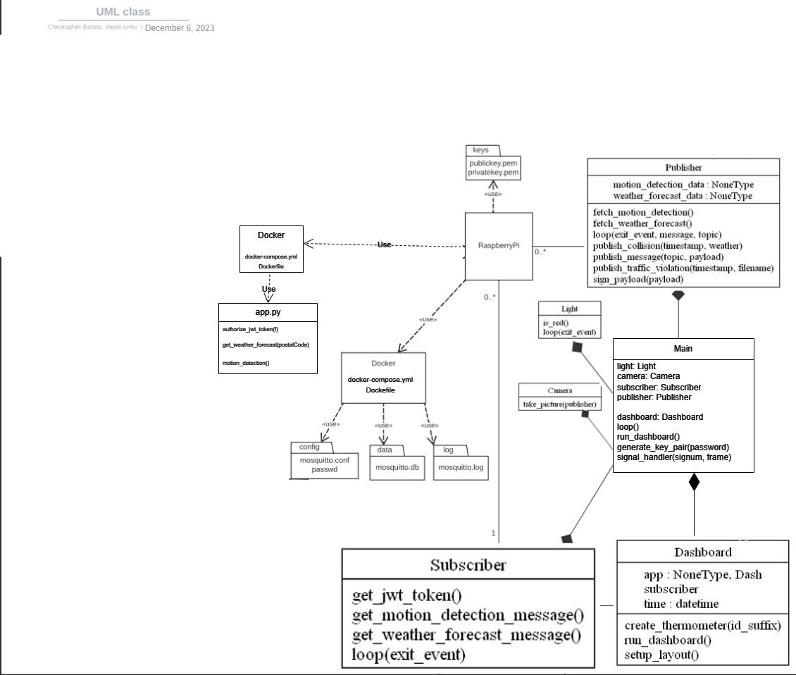

# TeamAssignment2

## Contributors

- [Christopher Bartos](https://gitlab.com/Christopher-) [2131542]
- [Vasilii Iurev](https://gitlab.com/yuryev)


## Deployment

### Ubuntu
*Ubuntu Deployment*

1. Clone the repository

```bash
git clone https://gitlab.com/yuryev/fall2023datacomassignment2/
cd fall2023datacomassignment2
```

2. Create virtual environment

```bash
python3 -m venv venv
source venv/bin/activate
```

3. Install the dependencies

```bash
python3 -m pip install -r requirements.txt
```

4. Start docker containers

```bash
sudo docker compose -f py_api/docker-compose.yml up --force-recreate --no-deps --build -d
sudo docker compose -f mqtt_lab/docker-compose.yml up --force-recreate --no-deps --build -d
```

5. Make a directory for video file output

```bash
mkdir video
```

6. Start the Main Application

```bash
python3 main.py
```

### Windows
*Windows Deployment*

1. Clone the repository

```powershell
git clone https://gitlab.com/yuryev/fall2023datacomassignment2/
cd fall2023datacomassignment2
```

2. Create virtual environment

```bash
python -m venv venv
 .\.venv\Scripts\activate
```

3. Install the dependencies

```bash
pip install -r requirements.txt
```

4. Start docker containers

```bash
docker compose -f py_api/docker-compose.yml up --force-recreate --no-deps --build -d
docker compose -f mqtt_lab/docker-compose.yml up --force-recreate --no-deps --build -d
```

5. Make a folder for video file output

```bash
mkdir video
```

6. Start the dashboard

```bash
python main.py
```

### UML


